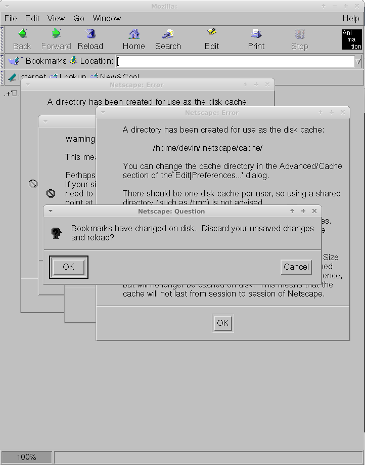

# mozilla

This repo contains the very first open source version of Mozilla with some
slight modifications.

The source is originally from here:
https://archive.mozilla.org/pub/mozilla/source/

and is based on mozilla-19980331-unix.tar.gz.

This is a version of Mozilla with the [Mariner layout engine](https://en.wikipedia.org/wiki/Mariner_(browser_engine)).

# Modifications

The original release of mozilla specified a GCC 2.7.2 requirement. This is a
very old C++ compiler that is not even C++98 complient. ``__cplusplus`` is
defined as "1" for this compiler.

In order to target modern systems some modifications were made to this repo.
Since GCC 2.7.2 is pre-C++98, some code compiled in C++98 throws errors so
we have made minimal changes to try to get it compiling with C++98.

The other change we've made is allowing this to be built on the amd64/x86\_64
architecture.

# Screenshot

